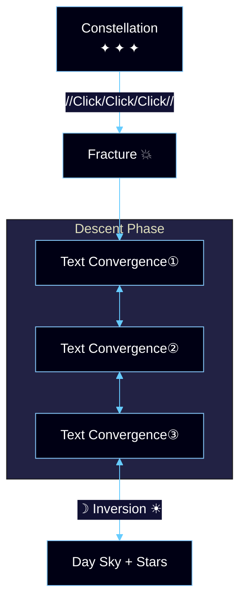

1. 
- Constellation
- img Silence ice
- Fracture

2.
- fall (Falling Star ✦)

- Text Animation
- Converging Text

3.   
- Light Intensifies

---

```mermaid
%%{
  init:{
    'theme':'base',
    'themeVariables': {
      'primaryColor': '#000014',
      'primaryTextColor': '#ffffff',
      'primaryBorderColor': '#88ccff',
      'lineColor': '#66ccff',
      'secondaryColor': '#111133',
      'tertiaryColor': '#222244'
    }
  }
}%%
flowchart TD

A["Constellation<br>✦ ✦ ✦"] -- //Click/Click/Click// --> C["Fracture 💥"]

subgraph descent["Descent Phase"]
direction TB
D["Text Convergence①"]
E["Text Convergence②"]
F["Text Convergence③"]
D <--> E <--> F
end

C --> D
F <-- ☽ Inversion ☀ --> H["Day Sky + Stars"]
```

---

