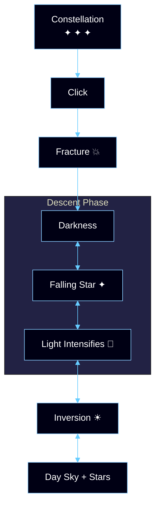

```mermaid
%%{
  init:{
    'theme':'base',
    'themeVariables': {
      'primaryColor': '#000014',
      'primaryTextColor': '#ffffff',
      'primaryBorderColor': '#88ccff',
      'lineColor': '#66ccff',
      'secondaryColor': '#111133',
      'tertiaryColor': '#222244'
    }
  }
}%%
flowchart TD

A["Constellation<br>✦ ✦ ✦"] --> B["Click"]
B --> C["Fracture 💥"]

subgraph descent["Descent Phase"]
direction TB
D["Darkness"]
E["Falling Star ✦"]
F["Light Intensifies 🌈"]
D <--> E <--> F
end

C --> D
F <--> G["Inversion ☀"]
G <--> H["Day Sky + Stars"]
```
